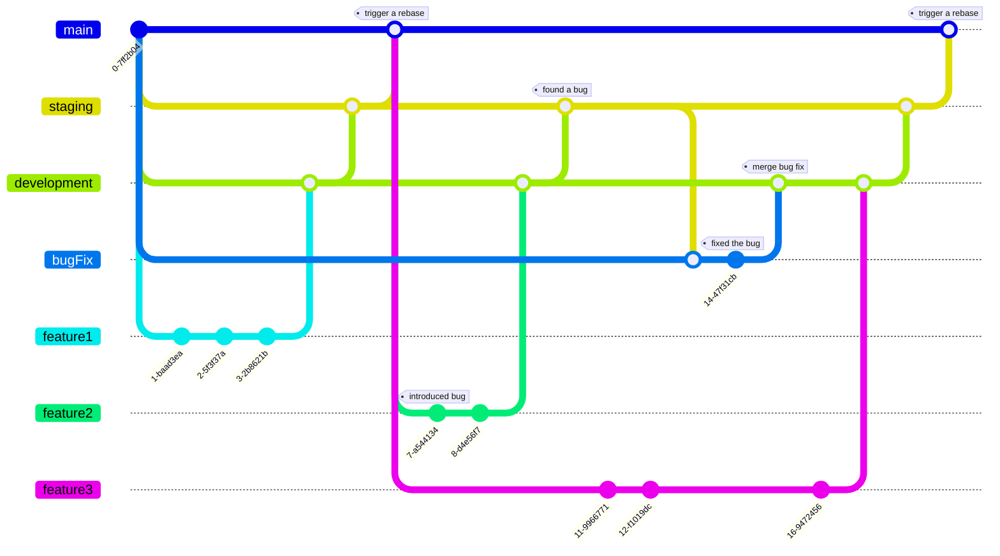

# Core

The Master Repository ("Core") centralizes by referencing sub-repositories. It automates submodule creation, tracks changes, and compiles code for release. Rollback mechanisms ensure stability, while documentation provides clarity. The final code is released to production.


## Core branches

| Branch Name | Purpose | Description |
|--------------|---------------|--------------|
| `main` or `production` | Production| This is the stable branch that mirrors what's currently in production. All code in this branch should be deployable at any time. Changes are introduced to this branch through merges from the `staging` branch. Whenever such merges occur, it might trigger rebuilds to ensure the master repository incorporates the latest stable changes.|
| `staging`| Integration| Serving as the primary integration branch, this is where features and fixes from the `development` branch are combined and tested cohesively. Before merging into `staging`, a code review ensures that the integrated features and fixes meet the required standards. The `staging` branch acts as a buffer before changes are moved to the `main` or `production` branch, ensuring that only well-tested and integrated code reaches production. |
| `development`| Development Integration  | This is a dynamic and active branch where all the development efforts converge. Features and bug fixes are merged into this branch before they are tested in `staging`. Once a feature or fix is complete, a pull request is marked, signaling that it's ready for code review. After the review, and once any feedback is addressed, the changes are merged into the `development` branch.|
| `hotfix/*`| Quick Fixes| For urgent fixes that need to be applied directly to the production code. These branches allow for rapid fixes to critical issues in the production environment. Once the fix is complete and tested, it's merged into the `main` or `production` branch and subsequently into other relevant branches to ensure consistency.|
| `release/*`| Pre-release| When preparing a new production release, this branch is used. It allows for final testing and any meta-level changes needed for a release, such as updating documentation, version numbers, etc. Once the release is deemed stable, it's merged into the `main` or `production` branch and then back into the `development` and `staging` branches to ensure all branches have the latest changes.|

### Core branches graph

```mermaid

gitGraph
       commit  id: "v0.0.1"

       branch hotfix
       branch release
       branch staging
       branch development
       branch submodule-a


       checkout submodule-a
       commit tag: "initial commit"
       commit
       commit

       checkout development
       merge submodule-a
       commit
       commit

       checkout staging
       merge development
       commit

       checkout release
       merge staging
       commit tag: "pre-release adjustments"
       commit

       checkout main
       merge release id: "v0.1.0" tag: "trigger a build"

       checkout hotfix
       merge main
       commit tag: "urgent fix"
       commit

       checkout main
       merge hotfix tag: "hotfix applied"

       branch submodule-b
       commit tag: "initial commit"
       commit
       commit
       commit
       commit

       checkout development
       merge submodule-b
       commit
       commit

       checkout staging
       merge development
       commit

       checkout release
       merge staging
       commit tag: "pre-release adjustments for submodule-b"
       commit

       checkout main
       merge release id: "v1.0" tag: "trigger a build"


```


## Submodule branches

| Branch Name | Purpose | Description |
|-------------|---------|-------------|
| `main` | Production | This is the stable branch that represents what's currently in production. It should be deployable at any time. Merges from `staging` occur here, triggering rebases. |
| `staging` | Integration | This branch serves as an integration branch for features and fixes. It's where changes from `development` are merged and tested together before moving to `main`. Bugs found in this branch are fixed in the `bugFix` branch. |
| `development` | Development Integration | This branch is where features (`feature1`, `feature2`, `feature3`) and bug fixes (`bugFix`) are merged together before they are tested in `staging`. |
| `feature1`, `feature2`, `feature3` | Feature Development | These branches are for developing individual features. Once a feature is complete, it's merged into `development`. |
| `bugFix` | Bug Fixes | This branch is for fixing bugs. It was specifically used to fix a bug introduced in `feature2`. After the bug is fixed, changes are merged back into `development`. |

### Submodule branches graph




## Submodule git commands

| Command | Description | Example |
|---------|-------------|---------|
| `git submodule add [repository] [path]` | Add a new submodule to the current repository. | `git submodule add https://github.com/user/repo.git libs/repo` |
| `git submodule init` | Initialize the submodules recorded in the index. | `git submodule init` |
| `git submodule update` | Fetch the submodule and check out the commit recorded in the superproject. | `git submodule update` |
| `git submodule update --init` | Initialize and update the submodule in one command. | `git submodule update --init` |
| `git submodule update --recursive` | Update the submodule and any nested submodules it contains. | `git submodule update --recursive` |
| `git submodule foreach [command]` | Execute a shell command in each checked-out submodule. | `git submodule foreach git pull` |
| `git submodule status` | Show the status of the submodule (commit it points to). | `git submodule status` |
| `git submodule deinit [path]` | Unregister the given submodule. | `git submodule deinit libs/repo` |
| `git submodule sync` | Synchronize submodule's remote URL configuration based on the superproject's configuration. | `git submodule sync` |
| `git submodule absorbgitdirs` | If a submodule has a `.git` directory, move the `.git` directory from a submodule to the superproject's `.git/modules` directory. | `git submodule absorbgitdirs` |
| `git clone --recurse-submodules [repository]` | Clone a repository and all its submodules. | `git clone --recurse-submodules https://github.com/user/superproject.git` |
| `git pull --recurse-submodules` | Pull from the superproject and all its submodules. | `git pull --recurse-submodules` |
| `git push --recurse-submodules=check` | Check if all submodule commits used by the superproject have been pushed. | `git push --recurse-submodules=check` |
| `git push --recurse-submodules=on-demand` | Push all changed submodules (that have been pushed). | `git push --recurse-submodules=on-demand` |

### Add a submodule

```
git submodule add https://github.com/<user or organization>/<repository>.git
                  - ex. https://github.com/JonahsOrg/submodule-b.git

git add .gitmodules <repository>
                    - ex. submodule-b

git commit -m "added <repository> to core"
              - ex. "added submodule-b to core"

git push
```


