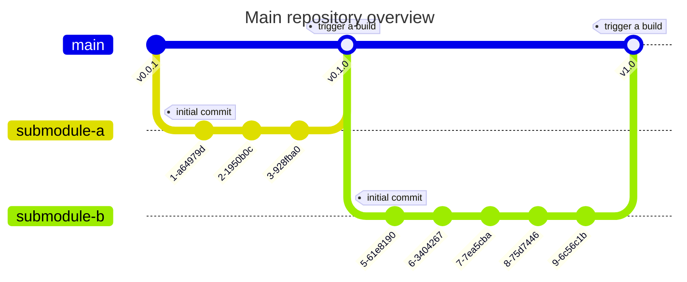
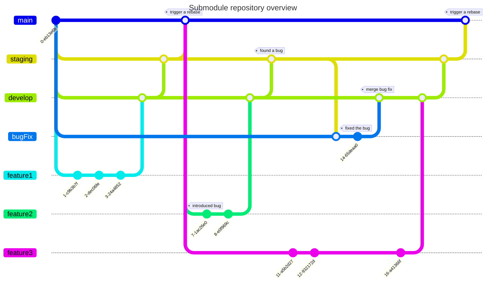

# Core

The Master Repository ("Core") centralizes by referencing sub-repositories. It automates submodule creation, tracks changes, and compiles code for release. Rollback mechanisms ensure stability, while documentation provides clarity. The final code is released to production.

## Submodule git commands

| Command | Description | Example |

<!-- prettier ignore -->

|---------|-------------|---------|
| `git submodule add [repository] [path]` | Add a new submodule to the current repository. | `git submodule add https://github.com/user/repo.git libs/repo` |
| `git submodule init` | Initialize the submodules recorded in the index. | `git submodule init` |
| `git submodule update` | Fetch the submodule and check out the commit recorded in the superproject. | `git submodule update` |
| `git submodule update --init` | Initialize and update the submodule in one command. | `git submodule update --init` |
| `git submodule update --recursive` | Update the submodule and any nested submodules it contains. | `git submodule update --recursive` |
| `git submodule foreach [command]` | Execute a shell command in each checked-out submodule. | `git submodule foreach git pull` |
| `git submodule status` | Show the status of the submodule (commit it points to). | `git submodule status` |
| `git submodule deinit [path]` | Unregister the given submodule. | `git submodule deinit libs/repo` |
| `git submodule sync` | Synchronize submodule's remote URL configuration based on the superproject's configuration. | `git submodule sync` |
| `git submodule absorbgitdirs` | If a submodule has a `.git` directory, move the `.git` directory from a submodule to the superproject's `.git/modules` directory. | `git submodule absorbgitdirs` |
| `git clone --recurse-submodules [repository]` | Clone a repository and all its submodules. | `git clone --recurse-submodules https://github.com/user/superproject.git` |
| `git pull --recurse-submodules` | Pull from the superproject and all its submodules. | `git pull --recurse-submodules` |
| `git push --recurse-submodules=check` | Check if all submodule commits used by the superproject have been pushed. | `git push --recurse-submodules=check` |
| `git push --recurse-submodules=on-demand` | Push all changed submodules (that have been pushed). | `git push --recurse-submodules=on-demand` |

## Graphs

