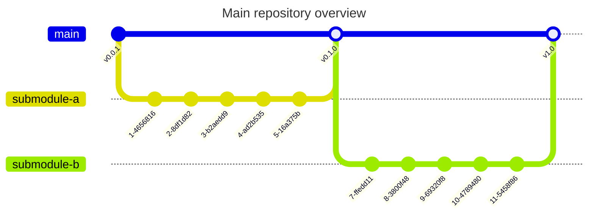
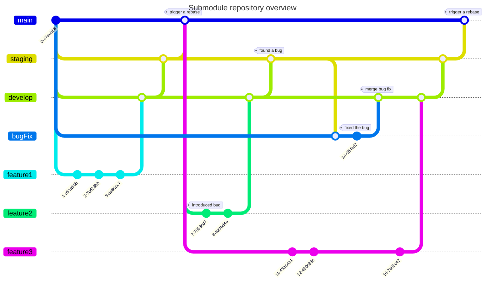

```mermaid
---
title: Main repository overview
---

gitGraph
       commit  id: "v0.0.1"

       branch submodule-a

       checkout submodule-a
       commit
       commit
       commit
       commit
       commit


       checkout main
       merge submodule-a id: "v0.1.0"


       branch submodule-b
       commit
       commit
       commit
       commit
       commit


       checkout main
       merge submodule-b id: "v1.0"

```

```mermaid
---
title: Submodule repository overview
---

gitGraph
  commit
  branch staging
  branch develop
  branch bugFix
  branch feature1

  checkout feature1
  commit
  commit
  commit

  checkout develop
  merge feature1

  checkout staging
  merge develop

  checkout main
  merge staging tag: "trigger a rebase"

  branch feature2
  checkout feature2
  commit tag: "introduced bug"
  commit

  checkout develop
  merge feature2

  checkout staging
  merge develop tag: "found a bug"

  checkout main
  branch feature3
  checkout feature3
  commit
  commit

  checkout bugFix
  merge staging
  commit tag: "fixed the bug"

  checkout develop
  merge bugFix tag: "merge bug fix"

  checkout feature3
  commit

  checkout develop
  merge feature3

  checkout staging
  merge develop

  checkout main
  merge staging tag: "trigger a rebase"

```
