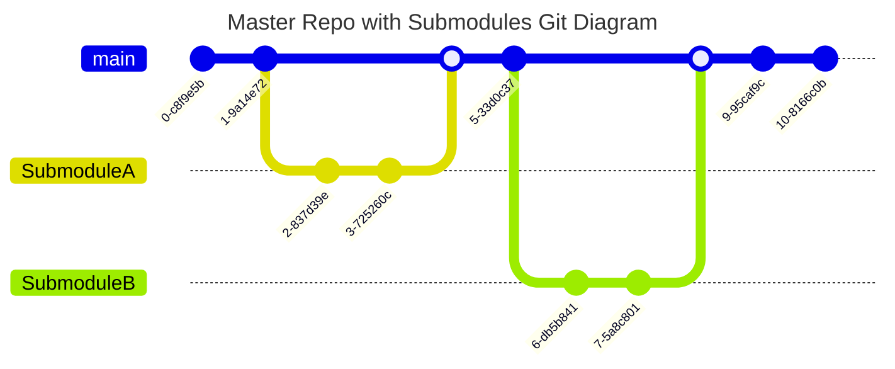
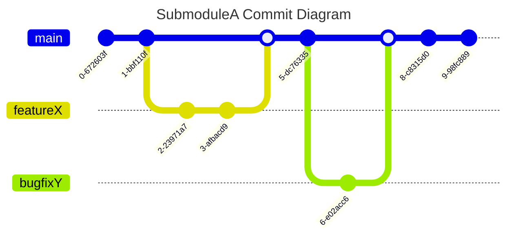

10.2.2023

---

## General overview

### **1. Initialize the Master Repository**

- **What**: Create a new repository or use an existing one as the master
  repository.
- **Why**: This will serve as the central hub that will contain references to
  all the submodules.

---

### **2. Add Submodules to the Master Repository**

- **What**: Use the `git submodule add <repository-url> <path>` command to add
  each submodule.
- **Why**: This links the specified submodule repository to the master
  repository at the given path.

---

### **3. Clone the Master Repository with Submodules**

- **What**: Use `git clone --recursive <master-repo-url>` to clone the master
  repository and all its submodules.
- **Why**: The `--recursive` flag ensures that all submodules and their content
  are fetched and checked out.

---

### **4. Update Submodules**

- **What**: After cloning, if there are changes in the submodule repositories,
  use `git submodule update --remote` to fetch the latest changes.
- **Why**: This ensures that your local submodules are up-to-date with their
  respective remote repositories.

---

### **5. Work within a Submodule**

- **What**: Navigate to the submodule's directory and treat it like any other
  Git repository—make changes, commit them, and push them.
- **Why**: Each submodule is essentially a separate Git repository, allowing you
  to manage its history independently.

---

### **6. Commit Submodule Changes in the Master Repository**

- **What**: After making changes in a submodule, navigate back to the master
  repository and commit the submodule's new state.
- **Why**: The master repository tracks the submodule's state (i.e., the commit
  it points to). This step ensures that the master repository references the
  latest commit of the submodule.

---

### **7. Pulling Changes with Updated Submodules**

- **What**: When pulling changes in the master repository that include submodule
  updates, use `git pull` followed by `git submodule update --recursive`.
- **Why**: This ensures that after updating the master repository, all
  submodules are also updated to their latest referenced commits.

---

### **8. Handling Merge Conflicts with Submodules**

- **What**: If there's a merge conflict involving a submodule, resolve the
  conflict by deciding which submodule state (commit) is the correct one to use.
- **Why**: Merge conflicts can arise if different branches reference different
  submodule states. Resolving the conflict ensures a consistent state across
  branches.

---

### **9. Removing a Submodule**

- **What**: To remove a submodule, delete its entry in the `.gitmodules` file,
  its configuration in the `.git/config` file, and untrack and remove its
  directory.
- **Why**: This ensures that the submodule is completely removed from the master
  repository and won't be fetched in future updates.

---

### **10. Regular Maintenance**

- **What**: Periodically run `git submodule foreach git pull origin main` (or
  the default branch of your submodule) to ensure all submodules are up-to-date.
- **Why**: This helps in keeping all submodules updated and reduces the chances
  of large, unexpected changes when updating them.

---

## Creating a new feature

### **1. Create a New Repository for the Feature**

- **What**: Initialize a new Git repository for the new feature. This can be
  done on platforms like GitHub, GitLab, etc.
- **Why**: This new repository will serve as the submodule for the specific
  feature you're developing.

---

### **2. Add the New Repository as a Submodule to the Master Repository**

- **What**: Navigate to the master repository locally and use the command
  `git submodule add <new-repo-url> <path/feature-name>`.
- **Why**: This links the new feature repository as a submodule to the master
  repository.

---

### **3. Clone the Master Repository with the New Submodule**

- **What**: If you're setting this up on a new machine or for a new developer,
  use `git clone --recursive <master-repo-url>`.
- **Why**: The `--recursive` flag ensures the new submodule and its content are
  fetched and checked out.

---

### **4. Navigate to the New Submodule Directory**

- **What**: Use `cd <path/feature-name>` to navigate into the submodule's
  directory.
- **Why**: This allows you to work directly within the submodule, treating it as
  its own standalone repository.

---

### **5. Create a New Branch for Development**

- **What**: Inside the submodule directory, use
  `git checkout -b feature-branch-name` to create a new branch.
- **Why**: It's a best practice to develop new features on separate branches,
  keeping the main branch stable.

---

### **6. Start Coding the Feature**

- **What**: Develop the feature as you would in any Git repository—write code,
  make commits, etc.
- **Why**: The submodule acts as an independent repository, allowing for
  isolated development of the feature.

---

### **7. Push Changes to the Feature Repository**

- **What**: Regularly push your changes to the remote feature repository using
  `git push origin feature-branch-name`.
- **Why**: This ensures that your changes are backed up remotely and allows
  other developers to see or collaborate on the feature.

---

### **8. Commit Submodule Changes in the Master Repository**

- **What**: After making significant progress or reaching milestones in the
  submodule, navigate back to the master repository and commit the submodule's
  new state.
- **Why**: The master repository tracks the submodule's state (i.e., the commit
  it points to). This step ensures that the master repository references the
  latest commit of the submodule.

---

### **9. Continue Development as Needed**

- **What**: Keep iterating on the feature, making commits in the submodule, and
  updating the master repository as necessary.
- **Why**: Continuous development and regular commits ensure that progress is
  tracked and that any issues can be pinpointed to specific changes.

---

### **10. Once the Feature is Complete**

- **What**: Merge the feature branch into the main branch of the submodule, then
  update the master repository to point to the merged state of the submodule.
- **Why**: This integrates the completed feature into the main codebase and
  ensures that the master repository references the stable version of the
  submodule.

---

## Possible automations

### General overview

#### **1. Initialize the Master Repository**

- **Automation**: Use GitHub API or similar to programmatically create new
  repositories when needed.
- **Why**: Streamlines the process of setting up new repositories, especially if
  done frequently.

---

#### **2. Add Submodules to the Master Repository**

- **Automation**: Script the addition of multiple submodules at once if there's
  a pattern or list to follow.
- **Why**: Reduces manual steps and potential errors when adding multiple
  submodules.

---

#### **3. Clone the Master Repository with Submodules**

- **Automation**: Use a post-clone hook to automatically run the `--recursive`
  flag or remind the developer to do so.
- **Why**: Ensures that developers always get the complete codebase, including
  submodules.

---

#### **4. Update Submodules**

- **Automation**: Implement a Git hook or scheduled task to periodically run
  submodule updates.
- **Why**: Keeps the submodules updated without manual intervention.

---

#### **5. Work within a Submodule**

- **Automation**: None specific here, as this is a general development step.

---

#### **6. Commit Submodule Changes in the Master Repository**

- **Automation**: Use a post-commit hook in the submodule to remind or
  automatically commit in the master repo.
- **Why**: Ensures that submodule updates are reflected in the master repo in
  real-time.

---

#### **7. Pulling Changes with Updated Submodules**

- **Automation**: Use a post-pull hook to automatically run submodule updates.
- **Why**: Simplifies the update process for developers.

---

#### **8. Handling Merge Conflicts with Submodules**

- **Automation**: Implement notifications or alerts for merge conflicts,
  especially if CI/CD detects them.
- **Why**: Provides immediate feedback and ensures quick resolution.

---

#### **9. Removing a Submodule**

- **Automation**: Script the removal process to ensure all steps are followed
  correctly.
- **Why**: Reduces the chance of incomplete submodule removal.

---

#### **10. Regular Maintenance**

- **Automation**: Schedule periodic submodule updates using cron jobs or
  similar.
- **Why**: Ensures that submodules are always up-to-date without manual checks.

---

### Creating a new feature

#### **1. Create a New Repository for the Feature**

- **Automation**: Use GitHub API or similar to programmatically create new
  repositories.
- **Why**: Streamlines the process of setting up new feature repositories.

---

#### **2. Add the New Repository as a Submodule to the Master Repository**

- **Automation**: As before, script the addition if there's a pattern or list to
  follow.
- **Why**: Reduces manual steps when adding the new feature as a submodule.

---

#### **3-10**:

- **Automation**: The steps from 3 to 10 in this flow are similar to the general
  overview. The same automation strategies can be applied here.

---

**Note**: While automations can greatly enhance the workflow, it's crucial to
ensure that they are well-documented and that the team is trained on their
behaviors. This ensures that the team can work efficiently without being caught
off-guard by automated processes.
