9.27.2023

- Feature card is drafted in project

- Feature card is converted to an issue

  - Feature branch is created
  - Pull request is opened for new feature branch
  - Feature issue is labeled "ready for dev"

- Feature branch is committed to

  - Comment is added to pull request detailing changes on feature branch
  - Feature branch is linted
  - Feature branch passes linting checks
  - Automated tests are run on the feature branch
  - Feature branch passes all automated tests

- Feature branch is committed to

  - Comment is edited on the pull request detailing the new changes
  - Feature branch is linted
  - Feature branch passes linting checks
  - Automated tests are run on the feature branch
  - Feature branch passes all automated tests

- Developer tags PR for review

  - Code reviewers are assigned to the PR

- Code reviewers provide feedback on the PR

- Feedback is addressed, the feature branch is committed to again with changes
  based on feedback

  - Comment is edited on the pull request detailing the changes made based on
    feedback
  - Feature branch is linted again
  - Feature branch passes linting checks after feedback changes
  - Automated tests are run again on the feature branch
  - Feature branch passes all automated tests post-feedback

- Code reviewers approve the PR

  - PR is merged into the main branch
  - Continuous integration builds and tests the main branch with the new feature
  - Main branch passes all tests and builds successfully

- Changes are deployed to a staging environment for further testing

- QA team tests the new feature in the staging environment

  - Any issues found in staging are reported and addressed
  - Once all issues are resolved and the feature is stable in staging,
    preparations for production deployment begin

- Backup of critical data is taken before deploying the new feature to
  production

- New feature is deployed to production

```mermaid
---
title: Issue flow overview - 9.27.2023
---
graph TD

  A[Feature card is drafted in project]
  B[Feature card is converted to an issue]
  C[Feature branch is created]
  D[Pull request is opened for new feature branch]
  E[Feature issue is labeled 'ready for dev']
  F[Feature branch is committed to]
  G[Comment is added to pull request detailing changes on feature branch]
  H[Feature branch is linted]
  I[Feature branch passes linting checks]
  J[Automated tests are run on the feature branch]
  K[Feature branch passes all automated tests]
  L[Feature branch is committed to]
  M[Comment is edited on the pull request detailing the new changes]
  N[Feature branch is linted]
  O[Feature branch passes linting checks]
  P[Automated tests are run on the feature branch]
  Q[Feature branch passes all automated tests]
  R[Developer tags PR for review]
  S[Code reviewers are assigned to the PR]
  T[Code reviewers provide feedback on the PR]
  U[Feedback is addressed, and necessary changes are made to the feature branch]
  V[Feature branch is committed to again with changes based on feedback]
  W[Comment is edited on the pull request detailing the changes made based on feedback]
  X[Feature branch is linted again]
  Y[Feature branch passes linting checks after feedback changes]
  Z[Automated tests are run again on the feature branch]
  AA[Feature branch passes all automated tests post-feedback]
  AB[Code reviewers approve the PR]
  AC[PR is merged into the main branch]
  AD[Continuous integration builds and tests the main branch with the new feature]
  AE[Main branch passes all tests and builds successfully]
  AF[Changes are deployed to a staging environment for further testing]
  AG[QA team tests the new feature in the staging environment]
  AH[Any issues found in staging are reported and addressed]
  AI[Once all issues are resolved and the feature is stable in staging, preparations for production deployment begin]
  AJ[Backup of critical data is taken before deploying the new feature to production]
  AK[New feature is deployed to production]


  A --> B
  B --> C
  B --> D
  B --> E
  C --> F
  D --> F
  E --> F
  F --> G
  F --> H
  G --> I
  H --> I
  I --> J
  J --> K
  K --> L
  L --> M
  L --> N
  M --> O
  N --> O
  O --> P
  P --> Q
  Q --> R
  R --> S
  S --> T
  T --> U
  U --> V
  V --> W
  V --> X
  W --> Y
  X --> Y
  Y --> Z
  Z --> AA
  AA --> AB
  AB --> AC
  AC --> AD
  AD --> AE
  AE --> AF
  AF --> AG
  AG --> AH
  AH --> AI
  AI --> AJ
  AJ --> AK

```

