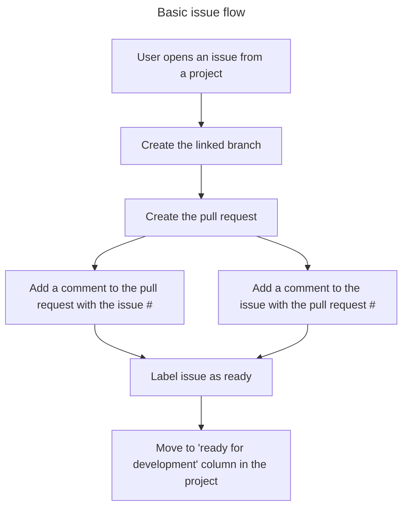
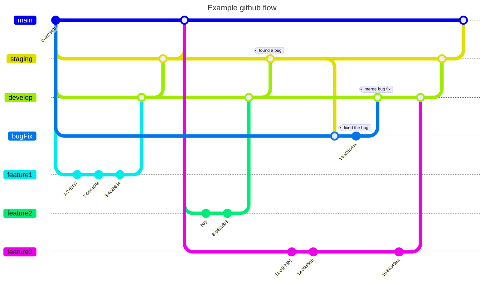

# To do

- [x] Label an issue
- [x] Create a new branch linked to the issue ticket
- [x] Create a pull request for the issue ticket
- [x] Link an issue and pull request together
  - [x] Add a comment to an issue with the pull #
  - [x] Add a comment to an pull request with the issue #
  - [x] Actually link the tickets together
    - I haven't been able to find a way to link them together the same way a
      user can manually do it -- this is a work around
- [x] fix locating a project card to find the specific issue, not just the
      newest created draft / issue
- [ ] check out
      https://docs.github.com/en/issues/managing-your-tasks-with-tasklists/about-tasklists
- [ ] check out milestones
- [x] ? create a workflow chart for a "draft issue" when it is converted to an
      issue
- [ ] Mark a branch as stale / needs rebase after becoming 30+ commits behind
- [x] Create a flowchart for a branch being created, what happens on commits,
      when it is ready to merge, etc.
- [x] Create a flowchart for a project item from draft to completion
- [ ] Create a concise list of automations we might want to implement and at
      what stage
- [ ] Being implementing the desired automations in the testing repo
- [ ] Create a workflow / mermaid chart for a "Multi-repo with a Master
      Repository" approach for large apps / projects. - the master repo would
      serve as the source of truth for all other apps --or-- master repo
      aggregates issues from other apps - Master repo - buyer repo - flipper
      repo - admin repo

# Links

## GraphQL

### Main pages

- https://docs.github.com/graphql
- https://docs.github.com/en/graphql/overview/explorer
- https://docs.github.com/en/graphql/reference

### Random pages

- https://medium.com/swlh/introduction-to-graphql-with-github-api-64ee8bb11630
- https://docs.github.com/en/graphql/guides/forming-calls-with-graphql#working-with-variables

### mutations

- https://docs.github.com/en/graphql/reference/mutations#createissue
- https://docs.github.com/en/graphql/reference/mutations#updateissue
- https://docs.github.com/en/graphql/reference/mutations#linkprojectv2torepository
- https://docs.github.com/en/graphql/reference/mutations#linkrepositorytoproject
- https://docs.github.com/en/graphql/reference/mutations#updateprojectv2
- https://docs.github.com/en/graphql/reference/mutations#addpullrequestreview

### objects

- https://docs.github.com/en/graphql/reference/objects#issue
- https://docs.github.com/en/graphql/reference/objects#projectv2
- https://docs.github.com/en/graphql/reference/objects#projectv2item
- https://docs.github.com/en/graphql/reference/objects#pullrequest

### interfaces

- https://docs.github.com/en/graphql/reference/interfaces#repositorynode

## Learning github and flows

### github features

https://github.com/features
https://github.blog/changelog/2023-01-10-github-actions-support-for-organization-wide-required-workflows-public-beta/

### github skills

https://skills.github.com/ https://github.com/skills/reusable-workflows

### github project management

https://github.com/features#features-project-management

### about sub-modules

https://www.atlassian.com/git/tutorials/git-submodule
https://www.aviator.co/blog/managing-repositories-with-git-submodules/

### working with sub-modules

https://github.blog/2016-02-01-working-with-submodules/
https://github.blog/2015-06-30-scripts-to-rule-them-all/
https://github.com/github/scripts-to-rule-them-all
https://stackoverflow.com/questions/8372625/git-how-to-push-submodule-to-a-remote-repository
https://lornajane.net/posts/2016/surviving-git-submodules
https://www.devroom.io/2020/03/09/the-git-submodule-cheat-sheet/

### about sub-trees

https://www.atlassian.com/git/tutorials/git-subtree

### github flow branching

https://nvie.com/posts/a-successful-git-branching-model/

### gitflow

https://docs.github.com/en/get-started/quickstart/github-flow

### learning games

https://learngitbranching.js.org/ https://ohmygit.org/
